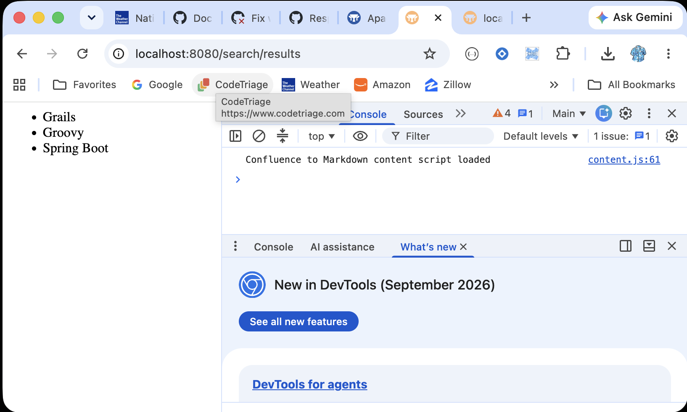

## Attempt to reproduce issue [#15819](https://github.com/apache/grails-core/issues/15819):

### Start the app
``` bash
./gradlew bootRun --offline --console=plain
```

### Hit the controller action
open `http://localhost:8080/search/results` in your default browser, and check the response and server logs for exceptions.

Check the browser page for errors:


...or via curl:
``` bash
$ curl -H 'X-Requested-With: XMLHttpRequest' http://localhost:8080/search/results
<ul id="results">    
        <li>Grails</li>    
        <li>Groovy</li>    
        <li>Spring Boot</li>
```

### Results
No exception thrown by application either via browser console or stdout/stderr.

If you remove the __results.gsp layout you get:

``` bash
Error 500: Internal Server Error
...
Caused by ControllerExecutionException: Unable to load template for uri [/search/__results]. Template not found.
```

## Grails 8.0.0 Documentation

- [User Guide](https://grails.apache.org/docs/8.0.0/guide/index.html)
- [API Reference](https://grails.apache.org/docs/8.0.0/api/index.html)
- [Grails Guides](https://guides.grails.org/index.html)
---

## Feature spring-boot-devtools documentation

- [Grails SpringBoot Developer Tools documentation](https://docs.spring.io/spring-boot/reference/using/devtools.html)

## Feature scaffolding documentation

- [Grails Scaffolding documentation](https://grails.apache.org/docs/8.0.0/guide/scaffolding.html)

## Feature asset-pipeline-grails documentation

- [Grails Asset Pipeline documentation](https://github.com/wondrify/asset-pipeline#readme)

## Feature mockito documentation

- [https://site.mockito.org](https://site.mockito.org)

## Feature geb-with-testcontainers documentation

- [Grails Geb Functional Testing for Grails with Testcontainers documentation](https://github.com/apache/grails-geb#readme)

- [https://groovy.apache.org/geb/manual/current/](https://groovy.apache.org/geb/manual/current/)

